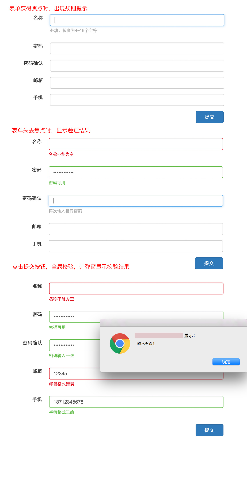

# 任务
实现一个注册页面，要求填入名称，密码，密码确认，邮箱以及手机。
对输入框中内容进行格式校验，并在其下方显示校验结果 校验规则：  
1. 名称字符数为 4~16 位,必填  
2. 密码首字母必须大写，并且密码长度不能小于 8，必填  
3. 密码确认必须和密码一致，必填  
4. 邮箱和手机号输入必须符合其格式，选填，  
### 任务需求

1. 表单获得焦点时，下方显示表单填写规则  
2. 表单失去焦点时校验表单内容  
3. 校验结果正确时，表单边框显示绿色，并在下方显示验证通过的描述文字  
4. 校验结果错误时，表单边框显示红色，并在下方显示验证错误的描述文字  
5. 点击提交按钮时，需要表单提交的默认行为，并且对页面中所有输入进行校验，校验结果显示方式同上。  
6. 所有表单校验通过，弹窗显示“提交成功”，否则显示“提交失败”  
### 注意事项

1. 要求功能实现与任务描述中完全一致  
2. 示例图仅为参考，样式不需要完全实现一致  
3. 实现中，尽可能考虑代码的可读性和可复用性  
4. 请注意代码风格的整齐、优雅  
5. 代码中含有必要的注释  
6. 不允许借助任何第三方组件库实现  
