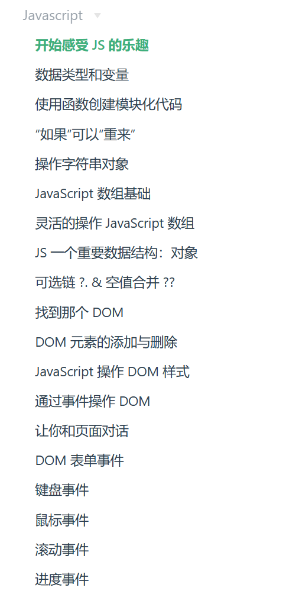

# practiceJS
[Week2 Answer](./week2Answer.md)  
[Week3 Answer](./week3Answer.md)  
[WIP Answer](./WIP-Answer.md)  
[WIP Answer-2](./WIP-Answer-2.md)
_________________
JavaScript Exercises  
Based on [Baidu Front-end Technology Academy ](http://ife.baidu.com/%E9%9B%B6%E5%9F%BA%E7%A1%80%E5%85%A5%E9%97%A8%E7%8F%AD/javascript/feelTheJoyOfJavascript.html)  

